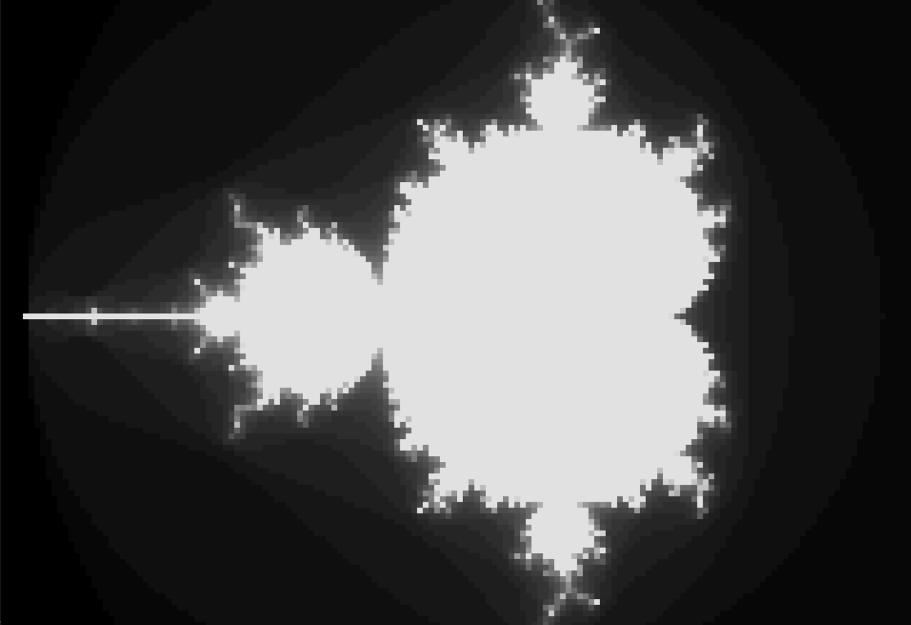
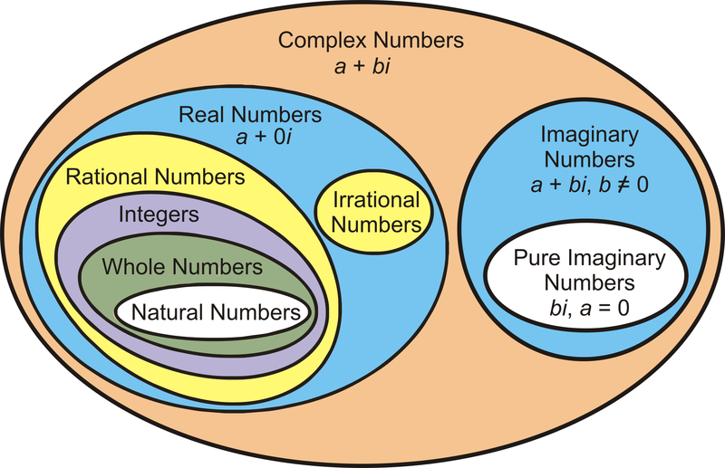
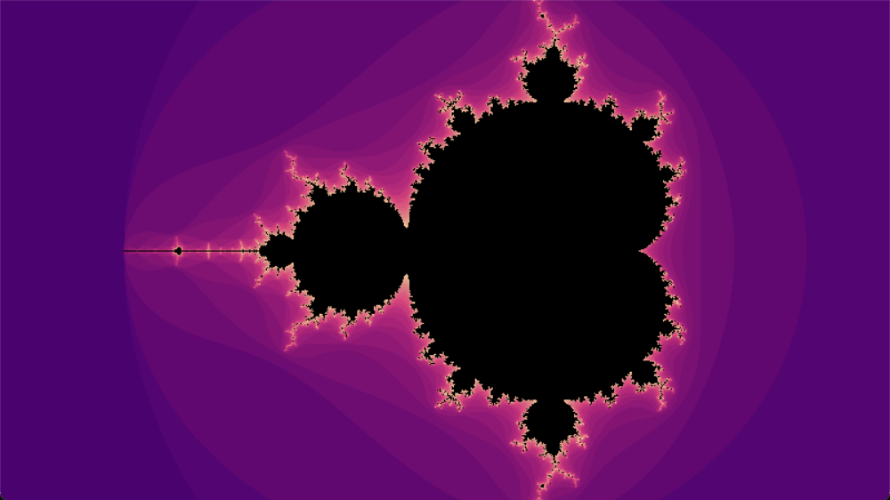

# Mandelbrot-s-fractal

A fractal is a geometric shape that contains detailed structure at arbitrarily small scales. It usually has a fractal dimension that strictly exceeds the topological dimension. Many fractals appear similar at various scales, as illustrated in successive magnifications of the Mandelbrot set. This exhibition of similar patterns at increasingly smaller scales is called self-similarity.

Fractals are infinitely complex patterns that are self-similar across different scales. They are created by repeating a simple process over and over in an ongoing feedback loop. Driven by recursion, fractals are images of dynamic systems.

## Mandelbrot Set

The Mandelbrot set is a famous fractal set in the field of complex numbers. It is a subset of the complex plane, defined by the behavior of a particular complex function under iteration. The Mandelbrot set is named after the mathematician Benoit Mandelbrot, who studied and popularized fractals.

The Mandelbrot set is defined by the following complex quadratic function: $f(z) = z^2 + c$

where:
- $z$ is a complex number
- $c$ is a constant complex number

The Mandelbrot set consists of all complex numbers $c$ for which the iterative process defined by the function $f(z)$ remains bounded when starting from $z_0 = 0$. In other words, the Mandelbrot set is the set of complex numbers $c$ for which the sequence:

$z_0 = 0$
$z_{n+1} = z_n^2 + c$

does not diverge to infinity.

Mathematically, the Mandelbrot set $M$ can be defined as:

$$M = \{c \in \mathbb{C} \mid \{z_n\}_{n=0}^\infty \text{ is bounded, where } z_0 = 0 \text{ and } z_{n+1} = z_n^2 + c\}$$

The boundary of the Mandelbrot set is a fractal curve with an infinitely complex structure, exhibiting self-similarity at all scales. This means that zooming in on any part of the boundary reveals similar patterns and shapes as the overall set.

## Complex numbers

Complex numbers are an extension of the real number system, which allows the representation of quantities that involve the square root of negative numbers. These numbers are expressed in the form $a + bi$, where $a$ and $b$ are real numbers, and $i$ is the imaginary unit defined as the square root of $-1$ ($i = \sqrt{-1}$).

The general form of a complex number is: $z = a + bi$
where:
- $z$ represents the complex number
- $a$ is the real part of the complex number
- $b$ is the imaginary part of the complex number
- $i$ is the imaginary unit ($\sqrt{-1}$)

Complex numbers can be represented on a complex plane, where the real part ($a$) is plotted on the horizontal axis ($x$-axis), and the imaginary part ($b$) is plotted on the vertical axis ($y$-axis). The complex plane allows for geometric interpretations and operations involving complex numbers.

## Mandelbrot Fractal Generator

The `main.py` script provided in this repository generates and displays a Mandelbrot fractal using the Python programming language and libraries such as Numpy and Pygame.

### Description

The `main.py` script defines classes and functions to construct and render the Mandelbrot fractal. Here's a brief overview of the key components:

- `Color`: A dataclass representing a color in RGB format.
- `Renderable` (Abstract Base Class): An abstract base class for objects that can be rendered and drawn.
- `Fractal`: A class that renders the Mandelbrot fractal to a numpy array and can draw it to a screen.
- `App`: The main application class that runs the fractal render loop.

### Functionality

The `Fractal` class utilizes Numba for performance optimization in rendering the fractal. It defines methods to generate the Mandelbrot set based on the Mandelbrot iteration algorithm. The `App` class sets up the Pygame window and handles the main loop for rendering and displaying the fractal.

### Demonstration

To run the script and see the Mandelbrot fractal in action:

1. Ensure you have Python installed on your system.
2. Install the required libraries by running `python -m pip install -r requirements.txt` in your terminal.
3. Execute the `main.py` script.
4. The Pygame window will display the rendered Mandelbrot fractal, allowing you to explore its intricate details and self-similar patterns.

## Screenshots

Screenshot of the result showing the visualization of the Mandelbrot fractal:

